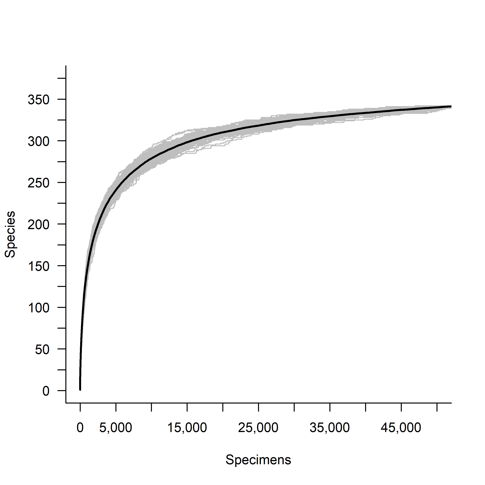
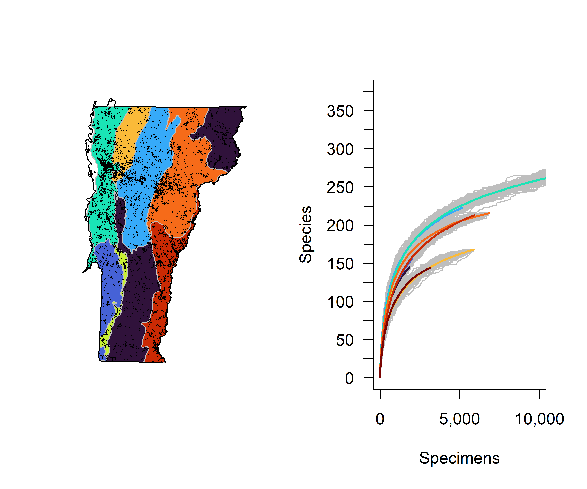

## Current Knowledge

Over 350 wild bee species have been recorded in Vermont, 70 of those were first documented within the last four years (2019-2022).  We now have a geographically and taxonomically complete assessment of the state's bee fauna, however, we have very little historical data and a poor understanding of the natural history for most species. 

 

 

 

## Threats    

Reports of insect declines are widespread, real, and worrying. The causes of these declines are not fully understood and likely vary by taxa, but climate change, land use change, and introduced species (plants and pathogens) are all thought to negatively impact wild and cultivated bee populations. 

##  Conservation   

Through a combination of modeling and field work, we have identified areas of the state that support unique, threatened and/or highly diverse communities of bees. While many of these sites are conserved, rare bees are generally not included in management plans and could potentially benefit from targeted management of foraging and nesting resources. 
